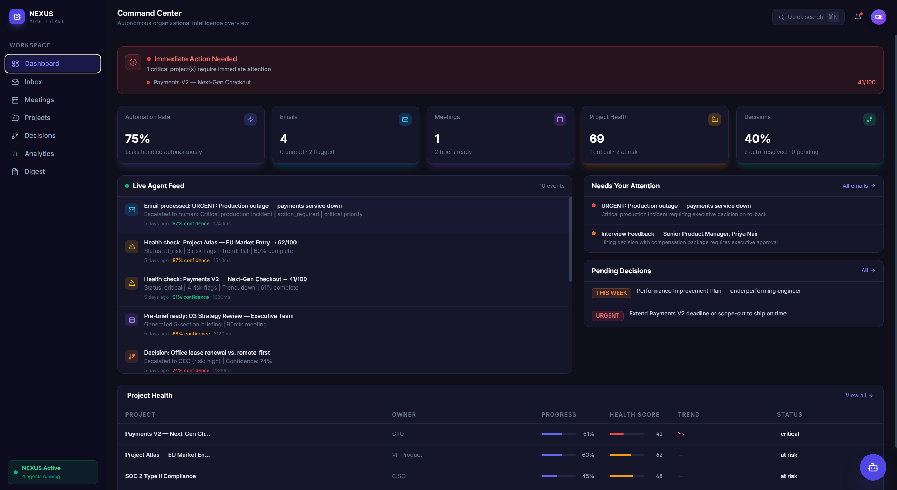
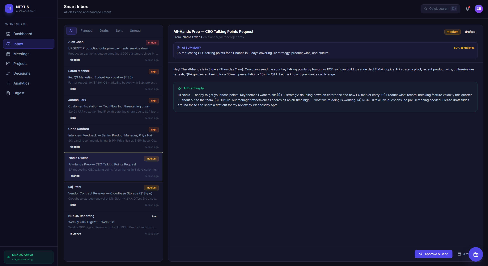
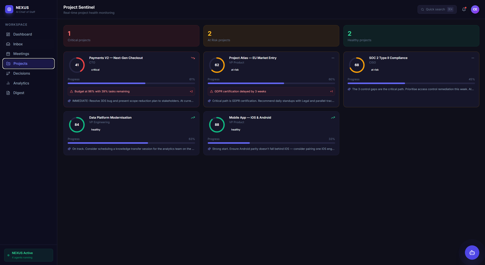
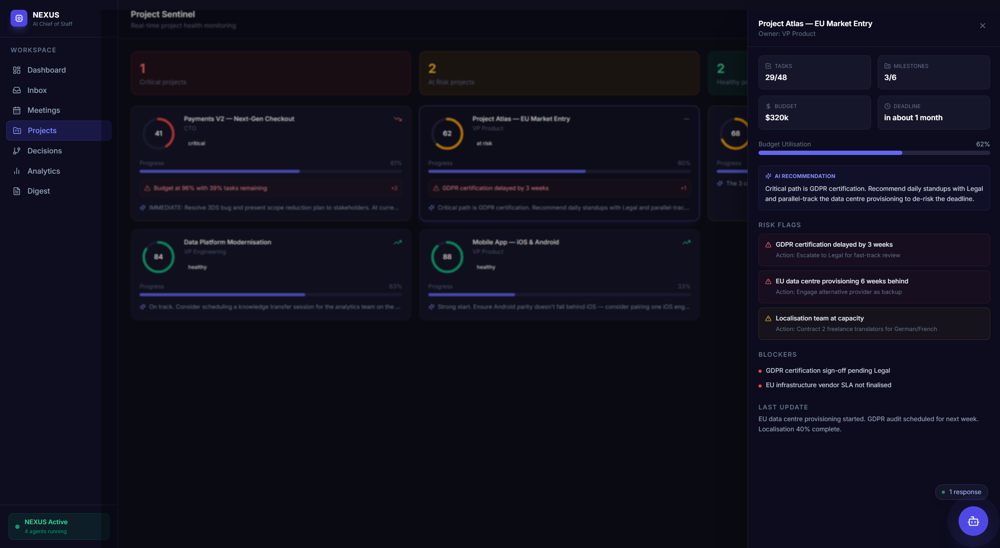
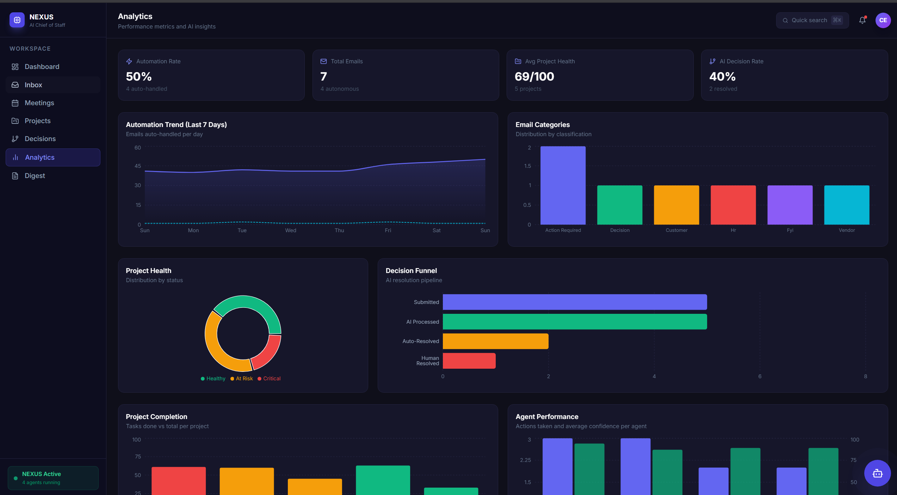
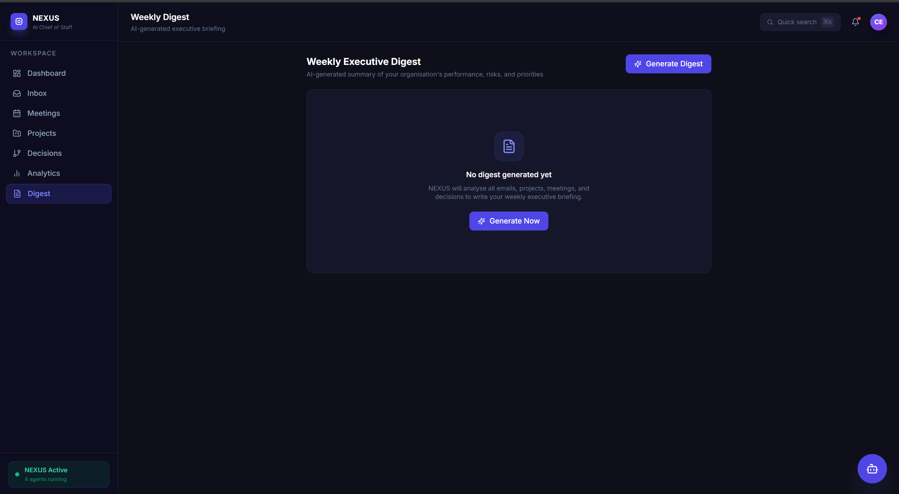
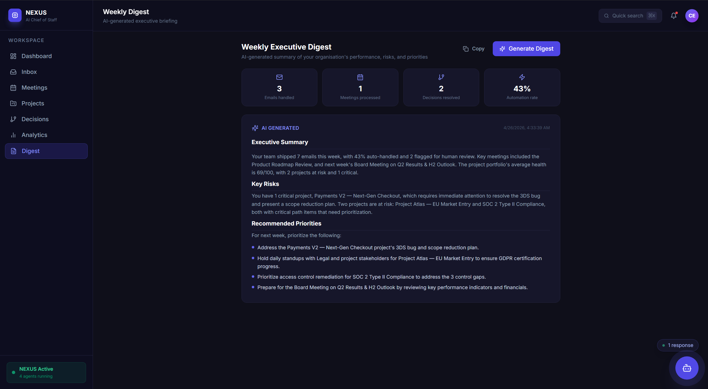
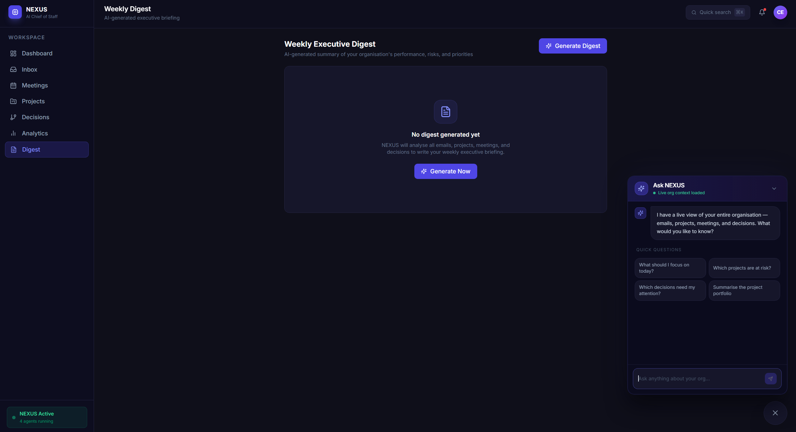
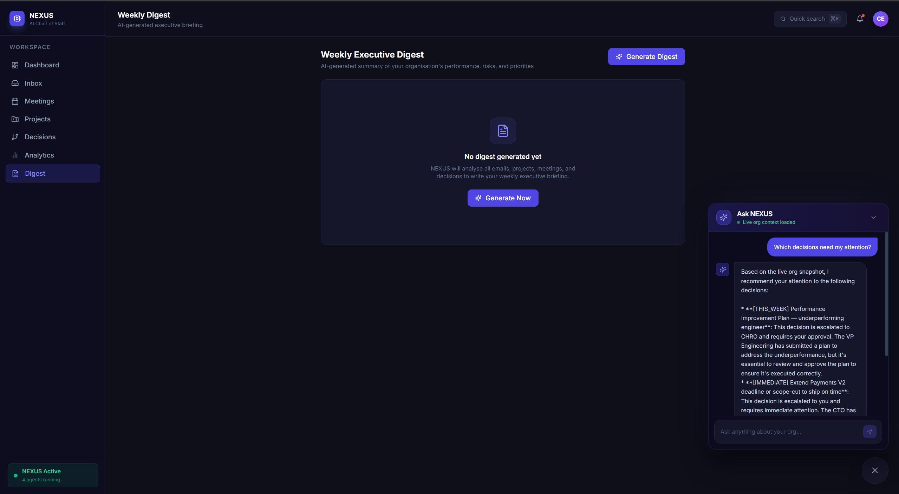

<div align="center">

# 🧠 NEXUS
### Autonomous AI Chief of Staff

*An agentic system that autonomously manages organizational workflows, triaging emails, preparing meeting briefs, monitoring project health, and routing decisions with minimal human intervention*


</div>

---

> *An AI Chief of Staff that autonomously runs your organization's operations*

NEXUS handles the class of organizational tasks people traditionally believe AI cannot do — sensitive email triage, meeting preparation, project risk assessment, and decision routing — all with minimal human touch. It's not a chatbot. It's an **autonomous agent system** that takes action.

---

## The Problem NEXUS Solves

Every organization spends enormous time on operational overhead:

- **Inbox overload** — Triaging, prioritizing, and drafting replies to 50+ emails a day
- **Meeting waste** — Showing up to meetings without context, leaving without clear action items
- **Project blindness** — Realizing a project is at risk only when it's too late
- **Decision bottlenecks** — Routine decisions queuing up waiting for a single executive

Traditional tools automate processes. NEXUS applies **AI judgment** to replace the need for a human coordinator entirely.

---

## Architecture

```
┌─────────────────────────────────────────────────────────────┐
│                         NEXUS                               │
│                                                             │
│  ┌──────────┐   ┌──────────────────────────────────────┐    │
│  │ Next.js  │   │          LangGraph Orchestrator      │    │
│  │ Frontend │◄──│                                      │    │
│  │          │   │  ┌────────┐  ┌─────────┐             │    │
│  │ Dashboard│   │  │ Email  │  │ Meeting │             │    │
│  │ Inbox    │   │  │ Agent  │  │ Agent   │             │    │
│  │ Meetings │   │  └────────┘  └─────────┘             │    │
│  │ Projects │   │  ┌────────┐  ┌──────────┐            │    │
│  │ Decisions│   │  │Project │  │ Decision │            │    │
│  └──────────┘   │  │Sentinel│  │  Agent   │            │    │
│       │         │  └────────┘  └──────────┘            │    │
│       │ REST    └──────────────────────────────────────┘    │
│       │ WebSocket      │                                    │
│  ┌────▼────────────────▼──────────────────────────────┐     │
│  │             FastAPI Backend                        │     │
│  │   SQLite DB · ChromaDB Vector Store                │     │
│  └────────────────────────────────────────────────────┘     │
│                         │                                   │
│              ┌──────────▼────────────┐                      │
│              │    NVIDIA NIM         │                      │
│              │  DeepSeek V4 Flash    │                      │
│              └───────────────────────┘                      │
└─────────────────────────────────────────────────────────────┘
```

### Agent Architecture (LangGraph)

The core of NEXUS is a **LangGraph state machine** with 4 specialized agents:

```
START → Router Node → [Email Agent | Meeting Agent | Project Sentinel | Decision Agent] → END
```

Each agent has:
- A specialized system prompt engineered for its domain
- Confidence scoring (0–1) for every decision
- Explicit reasoning trails stored in the database
- Escalation logic with configurable thresholds

---

## Screenshots

### Command Center — Dashboard
> Live org pulse: 75% automation rate, real-time agent feed, project health scores, and pending decisions that need your attention — all in one view.



---

### Smart Inbox — AI Email Triage
> Every email classified by priority and category, summarised in one line, and drafted for reply. The selected email shows an 89%-confidence AI draft the executive can approve with one click.



---

### Project Sentinel — Health Monitoring
> Five projects scored 0–100 in real time. Critical (red) and at-risk (amber) projects surface automatically with risk flags and AI remediation recommendations.




### Project Sentinel — Detail Panel
> Clicking any project slides in the full intelligence panel: task and milestone progress, budget utilisation, AI recommendation, risk flags with actions, blockers, and the latest status update.



---

### Analytics — Performance Metrics
> Cross-domain charts in one view: 7-day automation trend, email category breakdown, project health distribution, decision funnel, project completion rates, and per-agent confidence scores.



---

### Weekly Digest — Executive Briefing
> One click generates a full executive briefing synthesised from all emails, meetings, projects, and decisions — with executive summary, key risks, and recommended priorities.





---

### Ask NEXUS — Floating AI Assistant
> A persistent chat widget with live org context loaded. Four quick-question prompts get you instant situational awareness without typing.



> In conversation: NEXUS cross-references emails, projects, and decisions to give a prioritised answer — not a generic one.



---

## Demo

> [*Walkthrough Video*](https://youtu.be/25n4Kv7HWWQ)
<!-- [](https://www.youtube.com/watch?v=YOUR_VIDEO_ID](https://youtu.be/25n4Kv7HWWQ)) -->

---

## What NEXUS Does (That People Think AI Can't)

### Email Intelligence Agent
- **Classifies** every email by priority (critical/high/medium/low), category, and sentiment
- **Summarizes** in 1–2 sentences
- **Drafts contextually appropriate replies** matching the executive's voice
- **Auto-sends** high-confidence replies (≥88%) with no human involvement
- **Escalates** sensitive emails (HR, legal, >$50k financial) with reasoning

### Meeting Intelligence Engine
- **Pre-meeting briefings**: Generates a 5-section intelligence document — objective, context, watch points, agenda, talking points
- **Post-meeting processing**: Extracts action items, owners, deadlines from raw notes
- **Automated follow-ups**: Drafts and sends personalized summaries to all attendees

### Project Sentinel
- **Health scores** (0–100) with explainability: *"Deducted 15 points — deadline in 14 days with 39% tasks remaining"*
- **Risk flag detection**: Categorizes by severity with specific remediation actions
- **Velocity tracking**: Detects trends across sprints
- **Proactive escalation**: Alerts stakeholders when projects cross critical thresholds

### Decision Engine
- **Autonomous resolution** for routine decisions (budget <$25k, policy-based, reversible)
- **Smart routing**: Escalates to the right stakeholder (CEO/CFO/CHRO/Legal) with context
- **Precedent matching**: References relevant policies and past decisions
- **Full audit trail**: Every decision logged with reasoning and confidence score

---

## Tech Stack

| Layer | Technology |
|---|---|
| LLM | NVIDIA NIM — DeepSeek V4 Flash (free tier) |
| Agent Framework | LangGraph (state machine orchestration) |
| Backend | Python 3.11 · FastAPI · SQLModel |
| Database | SQLite (dev) · PostgreSQL (prod) |
| Vector Store | ChromaDB |
| Frontend | Next.js 14 (App Router) · TypeScript · Tailwind CSS |
| Real-time | WebSocket (agent activity stream) |
| Deployment | Docker Compose |

---

## Quick Start

### Prerequisites
- Python 3.11+
- Node.js 20+
- A free [NVIDIA NIM API key](https://build.nvidia.com/) — click any model → "Get API Key"

### 1. Clone & configure

```bash
git clone https://github.com/Sachin2102/nexus.git
cd nexus

# Backend config
cp backend/.env.example backend/.env
# Edit backend/.env and add your NVIDIA_API_KEY
```

### 2. Start the backend

```bash
cd backend
python -m venv .venv
source .venv/bin/activate    # Windows: .venv\Scripts\activate
pip install -r requirements.txt

uvicorn main:app --reload --port 8000
```

The backend will:
- Create the SQLite database automatically
- Seed rich demo data (emails, meetings, projects, decisions, agent events)
- Start serving the API at `http://localhost:8000`
- Expose the interactive API docs at `http://localhost:8000/docs`

### 3. Start the frontend

```bash
cd frontend
npm install
npm run dev
```

Open `http://localhost:3000` — NEXUS is running.

### 4. Run with Docker

```bash
# Copy and configure env
cp backend/.env.example .env
# Add NVIDIA_API_KEY to .env

docker-compose up --build
```

---

## Project Structure

```
nexus/
├── backend/
│   ├── main.py                  # FastAPI app + WebSocket manager
│   ├── requirements.txt
│   ├── Dockerfile
│   ├── agents/
│   │   ├── orchestrator.py      # LangGraph state machine (the brain)
│   │   ├── email_agent.py       # Email classification + draft generation
│   │   ├── meeting_agent.py     # Pre-brief + post-meeting processing
│   │   ├── project_agent.py     # Health scoring + risk detection
│   │   ├── decision_agent.py    # Autonomous resolution + routing
│   │   └── base.py              # Shared LLM client + utilities
│   ├── api/
│   │   ├── dashboard.py         # Metrics, activity feed, org pulse
│   │   ├── emails.py
│   │   ├── meetings.py
│   │   ├── projects.py
│   │   └── decisions.py
│   ├── core/
│   │   ├── models.py            # SQLModel database models (all entities)
│   │   ├── database.py          # Engine + session management
│   │   └── config.py            # Pydantic settings
│   └── data/
│       └── seed.py              # Rich demo data seeder
├── frontend/
│   ├── app/
│   │   ├── layout.tsx           # Root layout with sidebar
│   │   ├── page.tsx             # Dashboard (command center)
│   │   ├── inbox/page.tsx       # Smart inbox
│   │   ├── meetings/page.tsx    # Meeting intelligence
│   │   ├── projects/page.tsx    # Project sentinel
│   │   └── decisions/page.tsx   # Decision engine
│   ├── components/
│   │   ├── layout/              # Sidebar, TopBar
│   │   └── dashboard/           # MetricsGrid, AgentActivity, OrgPulse
│   └── lib/
│       ├── types.ts             # TypeScript interfaces
│       └── api.ts               # API client + SWR fetcher
└── docker-compose.yml
```

---

## API Reference

Full interactive docs available at `http://localhost:8000/docs`

| Endpoint | Description |
|---|---|
| `GET /api/dashboard/metrics` | KPI aggregates for all domains |
| `GET /api/dashboard/activity` | Recent agent event stream |
| `GET /api/dashboard/org-pulse` | Overall org health signal (green/amber/red) |
| `GET /api/emails/` | List emails (filterable by status) |
| `POST /api/emails/{id}/process` | Trigger AI processing |
| `POST /api/emails/{id}/approve-draft` | Human approves AI draft → sends |
| `GET /api/meetings/` | List all meetings |
| `POST /api/meetings/{id}/generate-brief` | Trigger AI pre-brief generation |
| `POST /api/meetings
